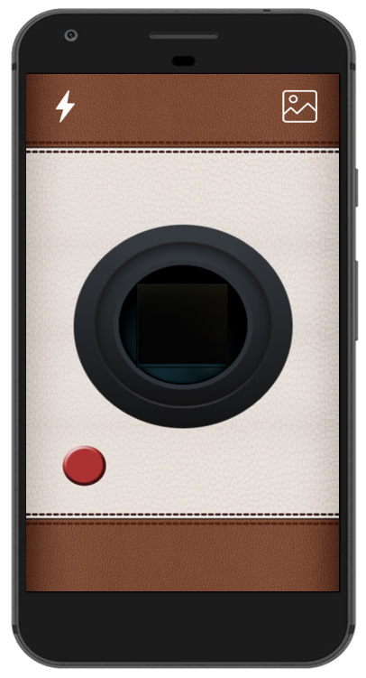

# 아날로그 카메라, 폴로라이드
안드로이드 카메라 어플리케이션 입니다.

포토 프린터를 이용하여 사진을 뽑았을 때 폴라로이드 필름처럼 보이게 하는
폴라로이드 카메라 어플 “POLORIDE”

## 개발환경

안드로이드

## 기능소개

1. 촬영 인터페이스를 카메라처럼 꾸미고 사진에 폴라로이드 프레임을 합친다.
촬영 직후에는 사진이 하얗게 보이는데,
일정 시간이 지나거나 핸드폰을 흔들면 깨끗한 사진을 볼 수 있다.
2. 갤러리에서 사진 선택 시 공유, 꾸미기, 사진 삭제를 할 수 있다.
3. 꾸미기 기능으로 사진에 그림을 그리거나 날짜를 표시 할 수 있고, 
입력한 텍스트를 프레임에 적용 시킬 수 있다. 또한 간단한 필터를 제공한다.
4. 꾸민 사진이나 원본 사진을 갤러리에서 선택하여 포토 프린터로 출력 할 수 있다.

## 시작하기

이 프로젝트에서는 Gradle 빌드 시스템을 사용합니다. 이 프로젝트를 빌드하려면 "gradlew build"명령을 사용하거나 Android Studio에서 "프로젝트 가져 오기"를 사용하십시오.

## 사용 라이브러리
1. AndroidPhotoFilters:'info.androidhive:imagefilters:1.0.7 - PhotoFiltersSDK는 모든 이미지 미디어에 멋진 효과를 만들기 위한 빠르고 강력 하고 유연한 이미지 처리 도구를 제공하는 것을 목표로 한다. 라이브러리는 API 15 이상의 OS를 지원한다. 라이브러리는 또한 내장 샘플 필터와 함께 제공된다.
2. com.github.ksoichiro:android-observablescrollview:1.5.2 - 스크롤 가능한 보기에서 스크롤 이벤트를 관찰하는 Android 라이브러리다. Android 5.0 Lollipop에 도입 된 툴바와 쉽게 상호 작용할 수 있으며 머트리얼 디자인 앱의 룩앤필을 구현하는 데 도움이 될 수 있다.
3. com.jakewharton:butterknife:8.8.1 - 필드에 주석을 달고 뷰 ID를 사용하면 레이아웃에서 해당 뷰를 찾아 자동 캐스팅 할 수 있고, 느린 리플렉션 대신 코드가 생성되어 뷰 조회를 수행할 수 있다.
